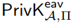
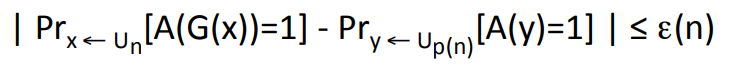

A pseudorandom generator G is an efficient, deterministic algorithm for transforming a short, uniform string (called a seed) into a longer, “uniformlooking” (or “pseudorandom”) output string.

That is, for any efficient statistical test (or distinguisher ) D, the probability that D returns 1 when given the output of the pseudorandom generator should be close to the probability that D returns 1 when given a uniform string of the same length. Informally, then, this means the output of a pseudorandom generator “looks like” a uniformly generated string to any efficient observer.
Let Dist be a distribution on l-bit strings. This means that Dist assigns some probability to every string in {0, 1}^ℓ; sampling from Dist means that we choose an ℓ-bit string according to this probability distribution.)

Classical cryptography
codes = chiper

Modern cryptography
codes = encryption schemes

message(plaintext) to other by using the shared key to encrypt (scramble) the message and thus obtain a ciphertext that is transmitted to receiver

in private-key setting same key is being used to encryption or decryption  => symmetric-key setting
asymmetric(public-key) use different keys to encryption or decryption => asymmetric setting

message space M, key space K
key-generation algorithm Gen = probabilistic algorithm to output a key k chosen according to some distribution.

encryption algorithm Enc = Enck(m)

decryption algorithm Dec = Deck(c)

Kerckhoffs’ principle: security should not rely on the encryption scheme being secret

History of Chipers
plaintext are written in lower case and ciphertext are written in UPPER CASE

Caesar’s cipher : shift letters of the alphabet 3 places
a was replaced with D and so on
"begin the attack now" with spaces removed =>EHJLQWKHDWWDFNQRZ
encryption method is fixed, there is no key, anyone learning how Caesar encrypted his messages would be able to decrypt

a variant Caesar’s cipher called ROT-13 (where the shift is 13 places instead of 3) is still used nowadays in various online forums. 
It is not provide cryptographic security; it is used merely to ensure that the text (say, a movie spoiler) is unintelligible unless
the reader of a message makes the conscious decision to decrypt it.

shift cipher: a keyed variant of Caesar’s cipher

The mono-alphabetic substitution cipher :  symmetric encryption as the same key can be used to both encrypt and decrypt a message
It uses a fixed key which consist of the 26 letters of a “shuffled alphabet”.
a b c d e f g h i j k l m n o p q r s t u v w x y z
X E U A D N B K V M R O C Q F S Y H W G L Z I J P T
the key space is of size 26! =26 · 25 · 24 · · · 2 · 1, or approximately 2^88 is bigger than 2^80 but it is not secure because of statistical attack
e is most used letter so whatever seen most in chipertext that can be e in plaintext
q is generally followed by u
t h is likely to appear between t and e 
We conclude that although the mono-alphabetic substitution cipher has a large key space, it is still insecure

pi,with 0 ≤ pi ≤ 1, denote the frequency of the ith letter in normal English text
for example: p0 = 0.082
sum of pi^2 for 0<=i<=25 is 0.065 given
qi denote the frequency of the ith letter of the alphabet in this ciphertext
shift count k then pi should be equal to q(i+k)
Ij= sum of pi * q(i+j) for 0<=i<=25 Ik~0.065 for which j value is k
 I.C. does not change if you apply a substitution cipher to the text

The Vigenere (poly-alphabetic shift) cipher

## Perfectly Secret Encryption

random-number generation = 
“pool”of high-entropy( entropy as a measure ofunpredictability,high-entropy data is not necessarily uniform) data is collected 
+
processing the high-entropy to have sequence of nearly independent and unbiased bits

Since classical computation is deterministic we can collect the high-entropy data(unpredictable data is needed) from external inputs such as mouse events
High entropy data can have  lots of entropy it is not uniform we need to process it. ifwe see a 1 followed by a 0 then we output 0, and if we see a 0 followed by a 1 then we output 1. We thus obtain a uniformly distributed output from our initial high-entropy pool
Care must be taken in how random bits are produced, and using poor random-number generators can make good cryptosystem vulnerable to attack

 An encryption scheme is defined by Gen, Enc, and Dec, as well as a specification of a message space M with |M| > 1

 if |M| = 1 there is only one message and no point in communicating
key-generation algorithm Gen is a probabilistic algorithm that outputs a key k chosen according to some distribution
K the (finite) key space, set of all possible keys that can be output by Gen
The encryption algorithm Enc takes as input a key k ∈ K and a message m ∈ M, and outputs a ciphertext c
We now explicitly allow the encryption algorithm to be probabilistic (so Enck(m) might output a different ciphertext when run multiple times), 
and we write c ← Enck(m)
we also sometimes use the notation x ← S to denote uniform selection of x from a set S
In case Enc is deterministic, we may emphasize this by writing c := Enck(m)
C denote the set of all possible ciphertexts that can be output by Enck(m)
if Enc in case it is randomized, k ∈ K and m ∈ M
m := Deck(c) deterministic process
K is the one defined by running Gen and taking the output
k ∈ K, Pr[K = k] denotes the probability that the key output by Gen is equal to k 
Pr[M = m] is not determined by the encryption scheme itself
c ← Enck(m) We let C be the random variable denoting the resulting ciphertext and so, for c ∈ C, write Pr[C = c] to denote the probability that the ciphertext is equal to the fixed value c
Example
K = {0, . . . , 25}
Pr[K = k] = 1/26
Pr[M = a] = 0.7 
Pr[M = z] = 0.3
What is the probability that the ciphertext is B?
to have ciphertext as B we need to have M=a and K=1 or M=z and K=2
Pr[M = a ∧ K = 1] = Pr[M = a] · Pr[K = 1] = 0.7 * 1/26 
Pr[M = z ∧ K = 2] = Pr[M = z] · Pr[K = 2] = 0.3 * 1/26 

Pr[C = B] = Pr[M = a ∧ K = 1] + Pr[M = z ∧ K = 2] = 1/26

## conditional probabilities
what is the probability that the message a was encrypted, given that we observe ciphertext B
Pr[M = a | C = B] given C=B what is the probability of M=a
=0.7

​
  
P(A∣B)= /P(A⋂B)/P(B)= P(A)⋅P(B∣A)/P(B)

1 1 1
2/3 / 1/3 

## Perfect secrecy
Pr[M = m | C = c] = Pr[M = m]
Pr[EncK(m) = c] = Pr[EncK(m0) = c] for every m,m' ∈ M and c ∈ C 
probabilities depend only on the encryption scheme, not depend on the plaintext

## Perfect (adversarial) indistinguishability
A is adversary
Π = (Gen, Enc, Dec) is the encryption scheme
eav is eavesdrop
PrivK^eav
Pr[PrivKeavA,Π = 1]=1/2 is perfectly secret

Example 2.8 ' ye geri don oku

## One-Time Pad
a⊕b denote the bitwise exclusive-or (XOR) of two equal-length binary strings a and b
a = a1 · · · al and b = b1 · · · bl are l-bit strings
a⊕b is the l-bit string given by (a1⊕b1)· · ·(al⊕bl)
Deck(Enck(m)) = k ⊕ k ⊕ m = m
CONSTRUCTION
The message space M, key space K, and ciphertext space C are all equal to {0, 1}^l
{0, 1}^l set of all binary strings of length l 
Gen: chooses a key from K = {0, 1}^l according to the uniform distribution
Enc: c := k ⊕ m
Dec: m := k ⊕ c
one-time pad is perfectly secret
drawback: the key is as long as the message
is only secure if used once (with a given key)
it is easy to see that encrypting more than one message with the same key leaks a lot of information
c ⊕ c' = (m' ⊕ k) ⊕ (m' ⊕ k) = m ⊕ m'
## Limitations of Perfect Secrecy
any perfectly secret encryption scheme must have a key space that is at least as large as the message space.
If all keys are the same  length, and the message space consists of all strings of some fixed length, this
implies that the key is at least as long as the message
|K| < |M| then the scheme cannot be perfectly secret
## Shannon Theorem
the key-generation algorithm Gen must choose the key uniformly from the set of all possible keys (as in the one-time pad)
for every message m and ciphertext c there is a unique key mapping m to c
perfectly secret encryption schemes with |M| = |K| = |C| are “optimal.”

# Private-Key(Symmetric) Cryptography

Would	be	ok	if	a	scheme	leaked	information	with	8ny	probability	to	eavesdroppers	with	bounded	computa8onal	resources
Desktop	computer	≈	257	keys/year	
Modern	key	space:	2128	keys	or	more
### Concrete approach	
scheme is (t, ε)-secure, computa8onally	indisguishable, EAV-secure
Security	may	fail	with	probability	≤	ε
Restrict	a^en;on	to	a^ackers	running	in	;me	≤	t	
Pr[PrivKeavA,Π = 1]=1/2 + ε that means  Π is	(t,	ε)-indis8nguishable
### Asymptotic Approach
ppt: probabilistic polynomial-time 
n: security parameter, for	now can view as the key length, Fixed	by	honest	par;es	at	initalizaion, Known	by	adversary
A scheme is secure if any ppt adversary succeeds in breaking the scheme with at most negligible probability.
Say we have a scheme that is asymptotically secure. adversary can succeed in “breaking the scheme” 
for n=40
n^3 minutes 40^3 minutes = 6 weeks 
with probability 2^40/2^n => 1 probability
for n=50
50^3 minutes = 3 months
2^40/2^50 = 1/1000 probability
Increasing the security parameter also increases the time required to run the scheme, as well as the length of the key
Pr[PrivKeavA,Π = 1]=1/2 + 	O(t(n)/2^n)	
This	scheme	is	EAV-secure:	for	any	polynomial	t,	the	func;on	t(n)/2^n	is	negligible

## Pseudorandom Generators(PRG)
important building blocks for private-key encryption
G is an efficient, deterministic algorithm for transforming a short, uniform string (called a seed) into a longer, “uniformlooking” (or “pseudorandom”) output string
statistical test (or distinguisher ) D

|G(x)|	=	p(|x|)	>	|x|
result G(s) is a string of length l(n)
l(n) the expansion factor of G
read Example 3.15 later again from the book

### 3.6.1 Stream ciphers

Let	G be a deterministic algorithm, with |G(k)|	= p(|k|)
Gen(1^n):	output	uniform	n-bit	key	k   Security parameter	n	⇒	message	space	{0,1}^p(n)
pseudo	OTP	is	secure can be broken if weakness	is	found	in	G

### 3.4.2	CPA-security
Chosen-plaintext attacks(known-plaintext attacks)
oracle Enck(·)
Keyed function Fk(x)	=	F(k,	x)
|F(k,	x)|	=	|k|	=	|x|	
fixed	key	length	n the	algorithm	F	defines	a	distribution	over	functions	in	Funcn
number	of	funcBons	in	Funcn	is	2^(n2^n)	

Pseudorandom	funcBons	(PRFs)
Pseudorandom	permutations	(PRPs)	

Question
A student has 3500 songs on her phone, and chooses songs to play at random.
How many songs should the student expect to play before hearing some song
twice with probability at least 50%. [Hint: think about birthday paradox]

q is count
1-(3499/3500)^q*(q-1)/2 should be 0.5