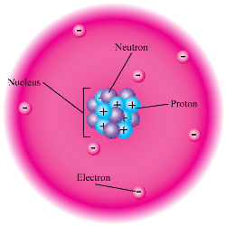
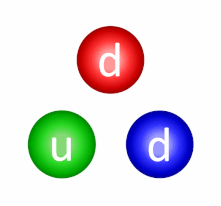

I am going to try to tell how technology works from Gravity to Javascript as someone who has an Electrical-Electronics Engineering Bachelor Degree, a non-completed master degree in Computer Science and 10 years of software development experience.

# Ingretients

- How gravity and other natural forces shape an electron
- Electron
- Electrical current
- Semiconductors =>Transistors
- Transistors =>Digital Logical Gates
- Gates => Arithmetic Operations
- Proccessor Architecture
- Instruction set => Software
- Volatile and Non-volatile Memory
- Operation System Components: kernel and shell
- Types of Operating Sytems
- Driver 
- Compiler and interpreter 
- Process and thread
- Programming Languages 
- Web Browser => HTML and javascript

# How gravity and other natural forces shape an electron
An atom consist of some of proton, neutron and electron. Proton and neutron are in nucleus(core) part of atom and electrons spreaded like cloud. 


Proton has positive charge, electron has negative charge and neutron has no charge so core is positive charged in contrast shell part of atom is negative charged.

**Extras:** Laplace defend determinism in contrast to Heisenberg. With determinism we could calculate every detail of universe if we had enough computer proccess power. This idea destroy the god believe or fate or destiny or any other mhystics ideas. Because determinism can calculate next steps of particles if we known t0 state. It could works for past states too. Indeed it works for bigger particles especially newtown physics area. But Heisenberg uncertainty principle says that position and momentum can be known at the same time accurately especially for the particles very close to planck constant. If position is known more momentum getting not known according to ````x*p>h/2````
If Heisenberg uncertainty principle didn't exist which means determism and Laplace is right 100% electrons would drop to nucleus because of electromagnetism and universe wouldn't be exist.  While electron is getting closer to positive nucleus position uncertanty is decreasing and momentum uncertanty is increasing by changing the velocity.

Electroncs are more likely to be found in some places, and these are called orbitals. Since the electron moves at the speed of light as wave form, we can only know that it is more likely to be in certain places. These places are also called orbitals.


Now we have to tell 4 fundamental forces.
## 1. Electromagnetic  Force 
Same charged particles like proton-proton push eachother back, opposite charged particles like proton-electron attract eachother. Electromagnetic force has 2 effects. First one is electric force apply on charged particles whether they are moving or not. Second one is magnetic force apply on moving charged particles. Actually they are same force because they create eachother as chaging electrical area create magnetisma and likewise. 

## 2. Gravity
Masses attract each other regardless of their charge. It exerts a force proportional to their masses and inversely proportional to the square of the distance between them. It is not very effective at atomic size, its effect increases at larger sizes as Newton found.
## 2. Strong Force
It works effectively in nucleus of an atom. Although all protons are + charged, it is this force that keeps the nucleus tidy by keeping them close to each other. It provides this with quarks in protons and neutrons. Its scope is narrow. However, it is very strong in the area where it is effective.

## 2. Weak Force 
It works in the nucleus like the strong force, and its effect is weaker than strong force and the electromagnetic force. Its scope is narrow.
