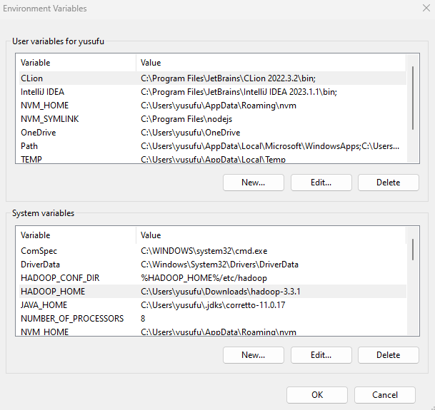
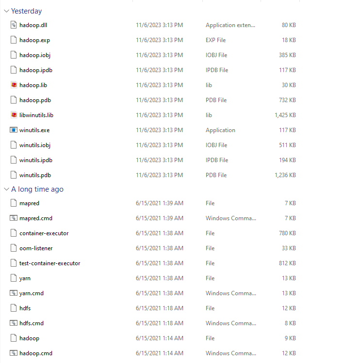

# Hadoop
1. Download from https://dlcdn.apache.org/hadoop/common/hadoop-3.3.1/hadoop-3.3.1.tar.gz and extract to a folder
2. Define Environment Variables 
HADOOP_HOME = C:\Users\yusufu\Downloads\hadoop-3.3.1
add C:\Users\yusufu\Downloads\hadoop-3.3.1 to PATH


For Windows there is no posix libraries to access file:// like filesystem, so we need to install winutils
https://cwiki.apache.org/confluence/display/HADOOP2/WindowsProblems
Download this https://github.com/kontext-tech/winutils/tree/master/hadoop-3.3.1/bin and extract to C:\Users\yusufu\Downloads\hadoop-3.3.1\bin folder


3. Configure Hadoop
Edit C:\Users\yusufu\Downloads\hadoop-3.3.1\etc\hadoop\core-site.xml

````
<configuration>
   <property>
     <name>fs.default.name</name>
     <value>hdfs://0.0.0.0:19000</value>
   </property>
</configuration>
````