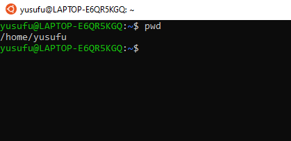
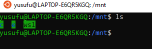
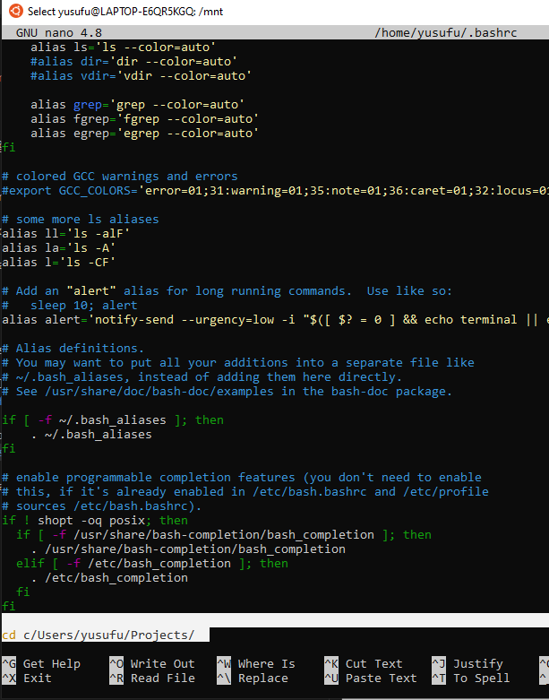
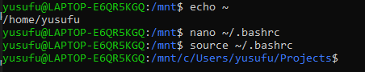

Wsl yani Windows Subsystem for Linux başladığı yeri görmek için pwd komutu ile yazdırdım. 

Yukarıda göründüğü gibi benim user'ımın bulunduğu path'dir bu. Az sonra bu noktayı değiştireceğiz. 
2 directory kadar yukarı çıkıp oradan neler olduğunu baktığımızda birçok klasör içinde bir de 'mnt' diye bir klasör olduğunu görüyoruz. 
'ls' komutu ile mnt içindekilere bakdığımızda c klasörü bu bizim Windows'umuzun bulunduğu klasör.

Çoğu Linux dağıtımında mesela benimki Ubuntu komut satırında tanımlı uygulamalar, enviroment variables ve bazı sistem ayarları '~/.bashrc' dosyasında tutulur.  Hatta Mac'de de burada. Buradaki **~** ismi tilda diye geçer Türkçe klavyelerde ALT GR ve ü harfi ile yapılır. Bu **~** adresi aslında benim user'ımın adresidir yani  **/home/yusufu**

**~/.bashrc** dosyasını düzenleyip komut satırı başladığı an artık **/home/yusufu** klasöründen başlama da **/mnt/c/Users/yusufu/Projects** adresinden başla.

Bunun için çoğu Linux'da hazır gelen komut satırı için text editörü olan nano ile **~/.bashrc** düzenleyeceğim.

**nano ~/.bashrc** ile açıp dosya sonuna **/mnt/c/Users/yusufu/Projects** yazdım.

Yaptığım değişiklik hemen komut satırına yansıması için **source ~/.bashrc** yazdım ve komut satırı yeniden yüklenip istediğim adreste başladı.

**Uyarı**: Linux tarafında bir uygulama yüklersem bunu yukarıdaki adrese yüklemez sadece Linux komut satırından Windows dosyaları ile çalışmak için yaptım. Çünkü WSL'de arayüz yok Windows'daki code editörleri kullanarak kod yazıp bunları Linux ile çalıştırmak istiyorum.

İlk yüklendiğinde hangi paketler ile gelmiş bunu daha sonra ile karşılaştırmak için yüklü paketlerin listesini bir dosyaya aşağığdaki gibi kaydediyorum.

**apt list --installed >history$(date +"%b-%d-%Y-%H-%M-%S").txt**
**grep install /var/log/dpkg.log > dpkg-$(date +"%b-%d-%Y-%H-%M-%S").log**

