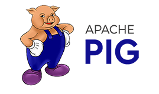

Hadoop is an open-source software framework that provides distributed storage and processing for massive datasets across computer clusters.

In the early 2000s, while Yahoo was working on the Apache Nutch open-source web crawler (though I’m not sure if Nutch was under Apache at that time), Google published influential papers around 2003–2004 on GFS (Google File System) and MapReduce. Inspired by these, Yahoo developed Hadoop and released it as an open-source project.

Here's an interesting detail: Doug Cutting, who made the largest contributions to Hadoop (while working at Yahoo), is also the creator of Apache Nutch and Lucene. Lucene is another open-source project under the Apache umbrella and forms the core of both Elasticsearch and Solr. The name "Hadoop" comes from Doug Cutting's son's yellow toy elephant, which also inspired Hadoop's logo and mascot.

Considering Doug Cutting's involvement in Lucene, Nutch, Solr, Elasticsearch, and Hadoop, it's fair to say these tools share similar architectural patterns and technical approaches.

Now, back to our topic. Google's GFS introduced a distributed file system, which inspired the creation of the Hadoop Distributed File System (HDFS). Similarly, Google's MapReduce paper became the foundation for Hadoop's MapReduce component. The names have remained almost unchanged.

---

## Apache Flume
  
Flume is commonly used to collect logs from various sources and write them to HDFS. During this pipeline, data can be filtered or aggregated. While typically used for log data, it can also handle other sources such as emails or network traffic.

Flume operates using three core concepts:
- **Source**: where the data comes from
- **Channel**: where data is processed or held
- **Sink**: where the data goes

You can send data from a source like an Avro client to HDFS without writing a single line of code. Kafka and Storm can also be used together to achieve what Flume does.

---

## Apache Pig
  
Pig is a platform for analyzing large datasets, using a scripting language called Pig Latin. These scripts are internally converted into MapReduce jobs and typically run on Tez.

It works with pre-structured data and can extract, transform, and load (ETL) data from various sources into HDFS. Pig can be run via a shell, UI, or Java-based server classes.

---

## Apache Spark

Spark is a general-purpose and fast computation engine that can use HDFS for storage. It supports ETL, machine learning, stream processing, and graph analytics. It provides an acyclic (non-looping) dataflow model and can run with or without Hadoop's YARN. Spark also supports in-memory caching for performance.

---

## MapReduce

MapReduce is a programming model used for distributed data processing in a Hadoop cluster. It transforms and reduces data using mapper and reducer functions. It's fault-tolerant — monitored by Hadoop, and jobs are restarted by the application master on failure.  
While still used by Hive and Pig, it’s often avoided today due to its batch-oriented nature.

---

## Apache Hive

Hive provides a data warehouse infrastructure and supports ad-hoc queries and data summarization. It offers an SQL-like engine that generates MapReduce jobs and typically runs on Tez. It enables interactive querying and is often used with tools like Impala or Hue.

---

## Apache Tez

Tez is an execution framework that provides a more efficient alternative to MapReduce, especially for tools like Hive and Pig. It supports acyclic dataflows and in-memory caching, uses YARN, and allows multiple reduce phases without corresponding map phases — improving performance.

---

## HBase

HBase is a scalable NoSQL key/value database designed for Hadoop. It supports very large tables and runs on top of YARN. It’s commonly used for real-time read/write access to big data.

---

## YARN (Yet Another Resource Negotiator)

YARN is a cluster resource manager and job scheduler. It supports fault tolerance by restarting failed application masters or moving them to another node. Traditional MapReduce is built into YARN. Tools like Storm and Impala directly use YARN. It can also support high availability via Zookeeper with hot standby modes.

---

## Other Technologies (To be expanded):

- **Kafka**: Distributed messaging system
- **Flink**: Stream processing engine
- **Sqoop**: Data transfer between RDBMS and Hadoop
- **Zookeeper**: Coordination and configuration service
- **Nifi**: Dataflow automation tool
- **Storm**: Real-time computation system
- **Drill**, **Presto**, **Druid**, **Apex**: Query engines and real-time analytics platforms

---

Let me know if you’d like help turning this into a fully styled Markdown blog post with navigation, images, or side notes for readers.
